<div align="center">

# 🛠️ Azure Support Agent

**An AI-driven Azure operations workbench that runs in _your_ subscription.** Point it at
your tenant and AI discovers your workloads, reverse-engineers live architecture diagrams,
and runs Well-Architected assessments — then a War Room of specialist agents helps you
investigate, monitor, and remediate.

[](https://portal.azure.com/#create/Microsoft.Template/uri/https%3A%2F%2Fraw.githubusercontent.com%2Fzmustafa%2FAzureSupportAgent%2Fmain%2Fdeploy%2Fmain.json)

[](LICENSE)
[](https://hub.docker.com/r/zmustafa/azure-support-agent)
[](backend/pyproject.toml)
[](frontend/package.json)
[](https://fastapi.tiangolo.com/)
[](CONTRIBUTING.md)

[Deploy](#-deploy-to-azure-one-click) · [Install guide](docs/INSTALLATION.md) · [Features](#-features) · [Screenshots](#-screenshots) · [Quick start](#-quick-start-local) · [Architecture](#-how-it-works) · [Docs](#-documentation)

</div>

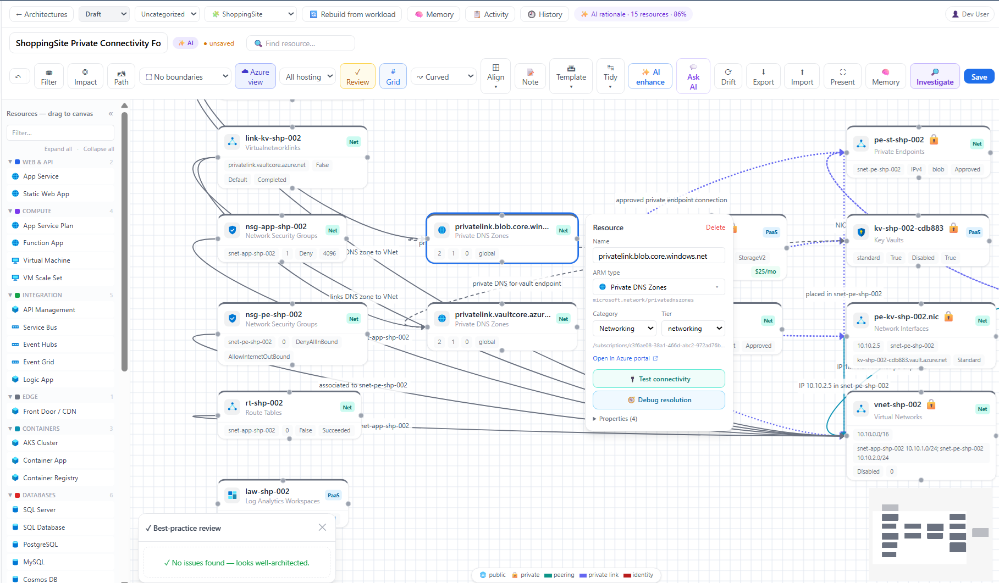

---

## Why Azure Support Agent?

Operating Azure at scale means hopping between the Portal, CLI, Resource Graph, Monitor,
Advisor, and a dozen blades just to answer one question. **Azure Support Agent puts an LLM
in the driver's seat** — it talks to your subscription through the official **Azure MCP
server** and a **Microsoft Graph (Entra ID) MCP server**, reasons over live evidence, and
turns *"why is the website throwing 5xx?"* into a ranked, validated answer — with the
diagrams, assessments, and dashboards to back it up. And it doesn't just wait to be asked:
a whole **Proactive Support** suite continuously scans your estate for coverage gaps and
looming retirements, while scheduled autonomous agents push findings to Teams, Jira, or
ServiceNow before they bite.

- 🧠 **Agentic, not just a chatbot** — a War Room of specialist agents investigates in parallel against your real Azure data.
- 🛡️ **Proactive, not just reactive** — a Proactive Support hub (Assessments · Identity · Monitoring, Telemetry & Backup/DR coverage · Retirement Radar · Telemetry Intelligence · Performance Profiler · Ownership · Tag Intelligence · Change Explorer · Estate Graph) surfaces risks before you ask, and scheduled autonomous agents notify you via connectors.
- 🏠 **Runs in your tenant** — one-click deploy to Azure Container Apps; your data never leaves your subscription.
- 🔒 **Safe by default** — Azure access is **read-only**, writes are **approval-gated + audited**, and AI providers stay **disabled until you configure them**.
- 🧰 **A whole workbench** — chat, investigations, architectures, a workloads cockpit, inventory, assessments, policy, monitoring, ownership, tagging, change forensics, an estate knowledge graph, and automations.

> Built for cloud architects, SREs, platform teams, and Azure support engineers.

## Table of Contents

- [Features](#-features)
- [Screenshots](#-screenshots)
- [Deploy to Azure (one-click)](#-deploy-to-azure-one-click)
- [Installation guide](docs/INSTALLATION.md)
- [Quick start (local)](#-quick-start-local)
- [How it works](#-how-it-works)
- [Tech stack](#-tech-stack)
- [Security & access model](#-security--access-model)
- [Documentation](#-documentation)
- [Contributing](#-contributing)
- [License](#-license)

## ✨ Features

<table>
<tr>
<td width="50%" valign="top">

### 💬 Conversational operations
Multi-session chat with isolated context, live SSE streaming, a per-message reasoning +
tool-call timeline that persists across reloads, image support, and smart starter
suggestions. Cancel a running turn anytime — work continues server-side and is saved.

</td>
<td width="50%" valign="top">

### 🕵️ Deep investigations ("War Room")
Toggle deep mode to dispatch specialist agents (Networking, Identity, Compute, Storage,
Security, Reliability, Cost, Monitoring) that research in parallel, form hypotheses, and
validate them against your live Azure data — then converge on a conclusion.

</td>
</tr>
<tr>
<td width="50%" valign="top">

### 📦 Workloads cockpit
Discover and group resources into workloads, then work a fleet **cockpit** with composite
**health scores**, a resource **taxonomy**, table/board views, and rich visualizations
(donut, radar, sparkline, treemap). Drill into a per-workload **command center**, or let
**Autopilot** AI-discover and propose workloads for you.

</td>
<td width="50%" valign="top">

### 🚀 Mission Control
Run **every** analysis against a workload from one cockpit — architecture, assessment,
coverage, identity and more — and read a single go/no-go posture with the highest-risk
items surfaced first.

</td>
</tr>
<tr>
<td width="50%" valign="top">

### 🗺️ Architectures + Architecture Memory
AI reverse-engineers live resources into interactive diagrams with best-practice review,
network boundaries, and cost hints. Save revisions, build collections, and keep persistent
**Architecture Memory** that powers dashboards and investigations.

</td>
<td width="50%" valign="top">

### 🕸️ Estate Graph
A live, **workload-aware knowledge graph** of your tenant with cost, retirement and RBAC
overlays — pan, zoom, search, and deep-link straight into the workload, architecture or
assessment behind any node.

</td>
</tr>
<tr>
<td width="50%" valign="top">

### 🪪 Ownership
A federated **owner directory** scoped by tenant, subscription or workload. **Export**
owners, **import** any CSV/Excel with AI column-inference and a preview, then **apply as
Azure tags** with snapshots and **safe revert**.

</td>
<td width="50%" valign="top">

### 🏷️ Tag Intelligence
A tag **census** with coverage, casing-drift detection and a natural-language → Azure
Resource Graph console. Propose, **apply and revert** tag changes with full **revision
history**.

</td>
</tr>
<tr>
<td width="50%" valign="top">

### 🛰️ Change Explorer
See **what changed, when, and who did it** across your estate — each change AI-categorized
and **risk-scored**, with plain-English insights that float the highest-risk changes to the
top for review.

</td>
<td width="50%" valign="top">

### ✅ Assessments & governance
Run Well-Architected-style assessments across Security, Reliability, Cost, Operations, and
Performance pillars — with custom controls, framework mappings (NIST, ISO, CIS), waivers,
finding lifecycle, and ticketing. Plus Policy compliance, baselines, and AI advisors.

</td>
</tr>
<tr>
<td width="50%" valign="top">

### 📈 Monitoring & resilience
**Monitor 2.0** customizable dashboards with AI authoring and ping history; **AMBA**
baseline-alert coverage with one-click Bicep/Terraform gap remediation; **Performance
Profiler**, **Backup/DR coverage**, **Retirement Radar**, and telemetry intelligence.

</td>
<td width="50%" valign="top">

### 🤖 Automations & workflows
Build custom sub-agents with scoped tools, schedule recurring tasks, chain Workbooks into
Playbooks, and route results through in-app Notifications and external connectors
(Jira, ServiceNow).

</td>
</tr>
<tr>
<td width="50%" valign="top">

### 🛡️ Proactive Support hub
One categorized landing page that unifies every posture & forensic dashboard — coverage,
assessments, identity, ownership, tagging, change forensics and the estate graph — so
nothing about your estate is more than a click away.

</td>
<td width="50%" valign="top">

### 🔌 Bring your own AI
11+ providers — OpenAI, Azure OpenAI, Anthropic Claude, Google Gemini, GitHub
Copilot/Models, Grok, Mistral, OpenRouter, ChatGPT (OAuth), **Claude OAuth (Pro/Max, incl.
Opus 4.8)**, Ollama, LM Studio — switchable at runtime with live model catalogs.
**Disabled until you set them up.**

</td>
</tr>
</table>

### Enterprise-ready

🔐 Read-only Azure by default · ✅ approval-gated writes · 🧾 full audit log ·
👥 RBAC (users / roles / groups) · 🔑 OIDC + SAML SSO · 🗝️ encrypted connection
credentials · 🖥️ Sandbox VMs for private-endpoint diagnostics · 🧩 multi-tenant Azure
connections.

## 📸 Screenshots

<table>
<tr>
<td width="50%">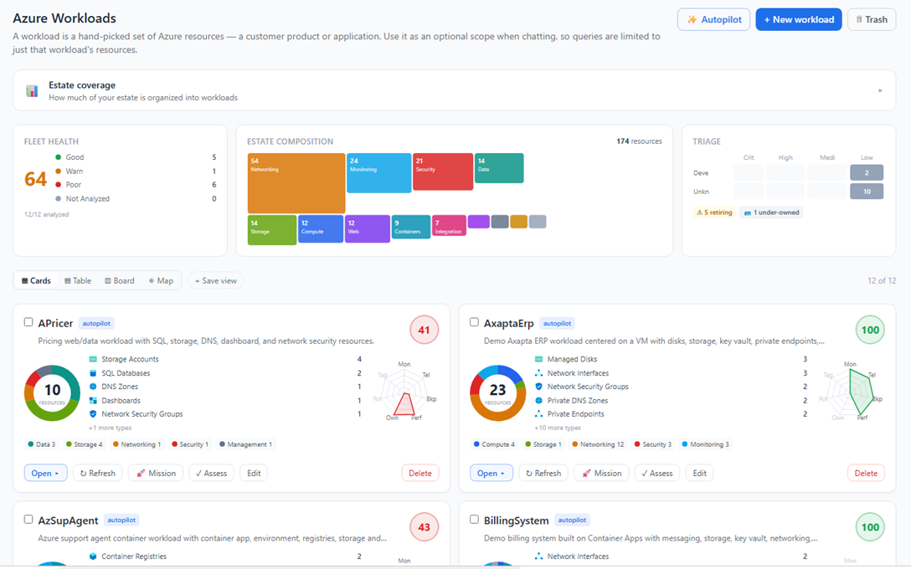<br/><sub><b>Workloads cockpit</b> — composite health scores, resource mix &amp; trend sparklines across your fleet.</sub></td>
<td width="50%">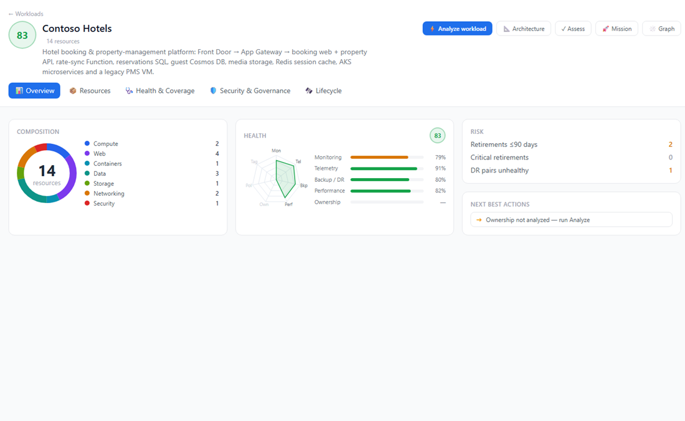<br/><sub><b>Workload command center</b> — health, coverage, risk &amp; next-best-actions for a single workload.</sub></td>
</tr>
<tr>
<td width="50%">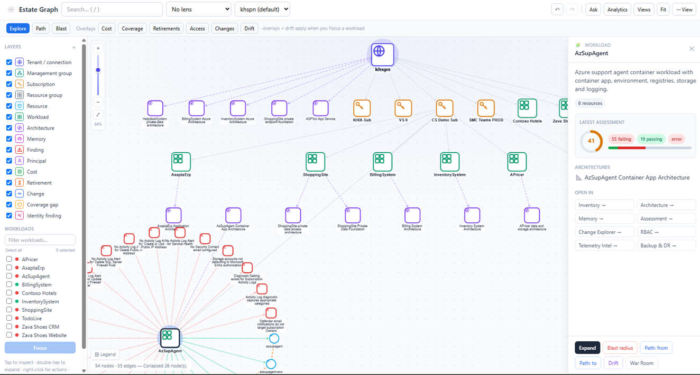<br/><sub><b>Estate Graph</b> — a live, workload-aware knowledge graph with cost, retirement &amp; RBAC overlays.</sub></td>
<td width="50%">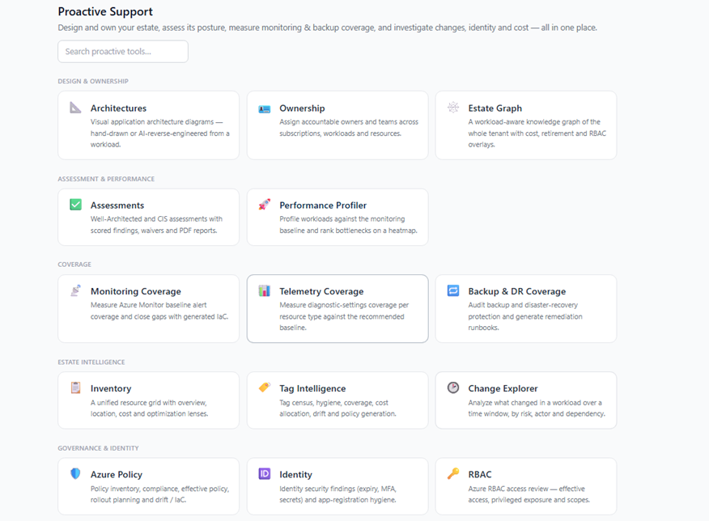<br/><sub><b>Proactive Support</b> — every posture &amp; forensic dashboard, grouped into one hub.</sub></td>
</tr>
<tr>
<td width="50%">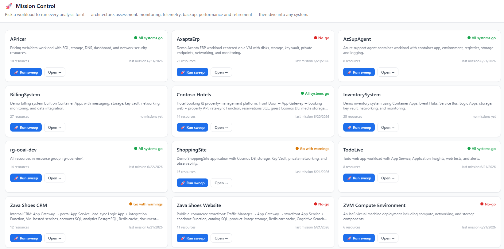<br/><sub><b>Mission Control</b> — run every analysis against a workload from one go/no-go cockpit.</sub></td>
<td width="50%">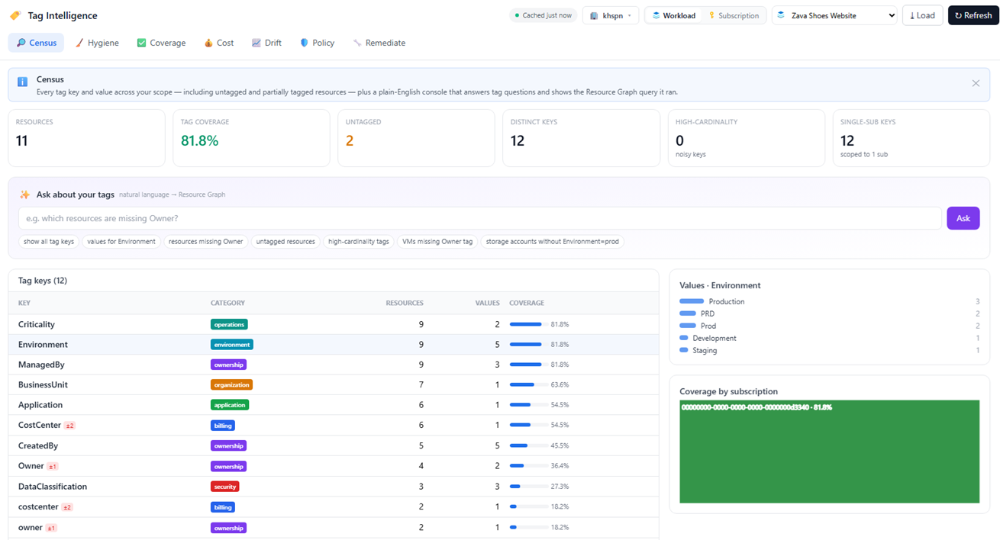<br/><sub><b>Tag Intelligence</b> — tag census, coverage &amp; casing drift with a natural-language console.</sub></td>
</tr>
<tr>
<td width="50%">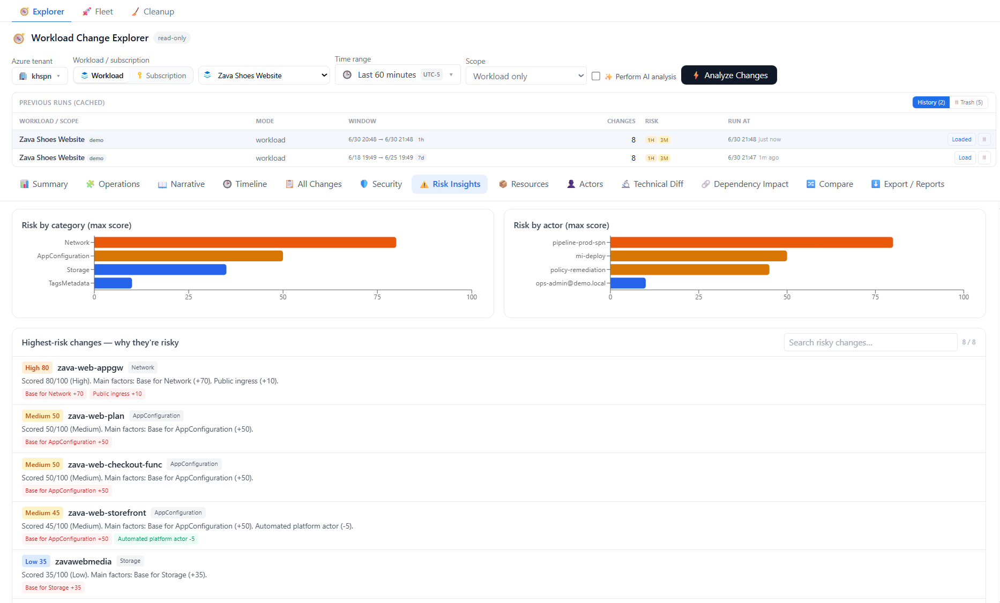<br/><sub><b>Change Explorer</b> — what changed, when, who did it, how risky, and what it impacts — in plain English.</sub></td>
<td width="50%"><br/><sub><b>Architectures designer</b> — design diagrams with AI rationale &amp; best-practice review.</sub></td>
</tr>
<tr>
<td width="50%">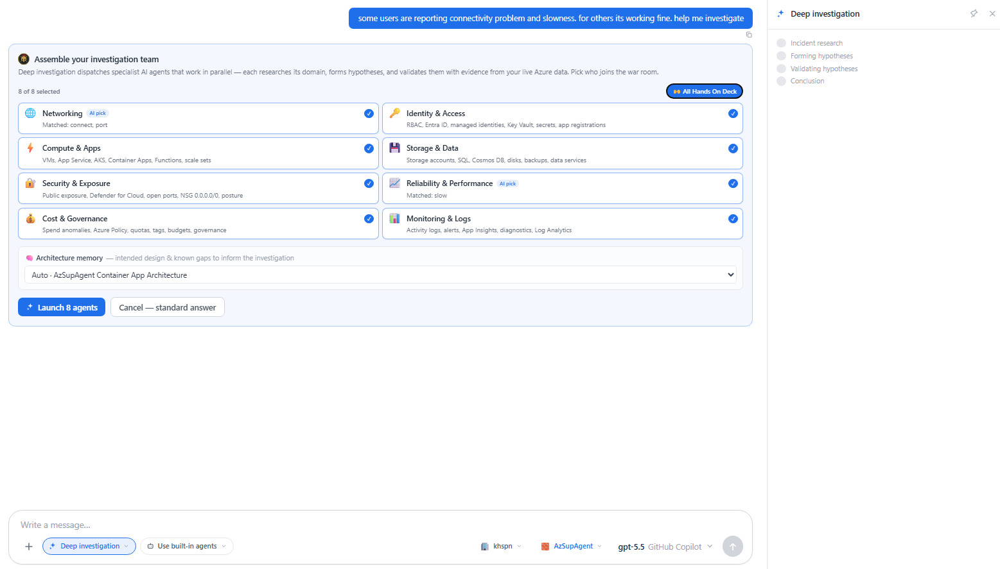<br/><sub><b>War Room</b> — assemble a team of specialist agents to investigate in parallel.</sub></td>
<td width="50%">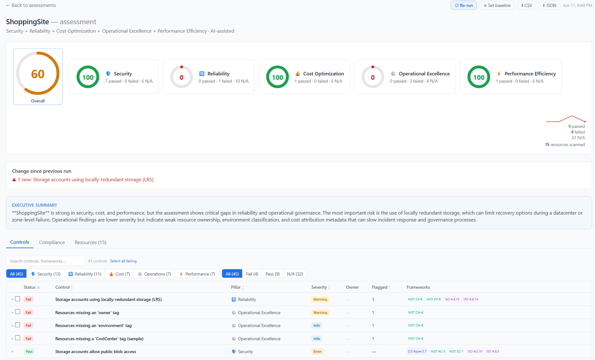<br/><sub><b>Assessments</b> — pillar scores, controls, and framework mappings (NIST/ISO/CIS).</sub></td>
</tr>
<tr>
<td width="50%">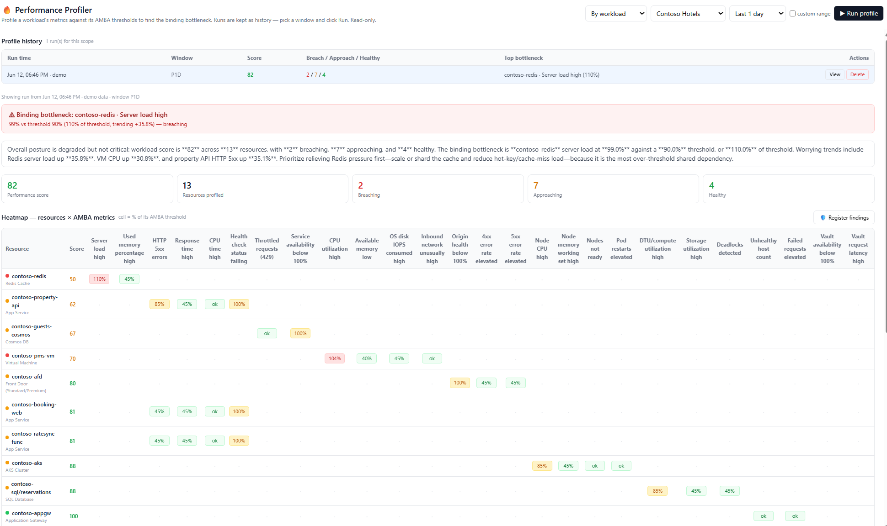<br/><sub><b>Performance Profiler</b> — resource × AMBA-metric heatmap to find bottlenecks.</sub></td>
<td width="50%">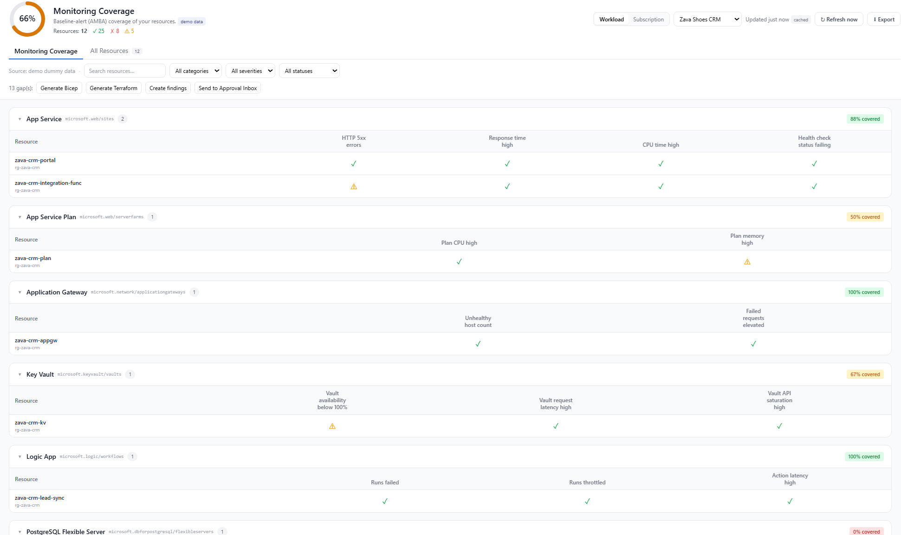<br/><sub><b>Monitoring coverage</b> — AMBA baseline-alert gaps with Bicep/Terraform fixes.</sub></td>
</tr>
<tr>
<td width="50%">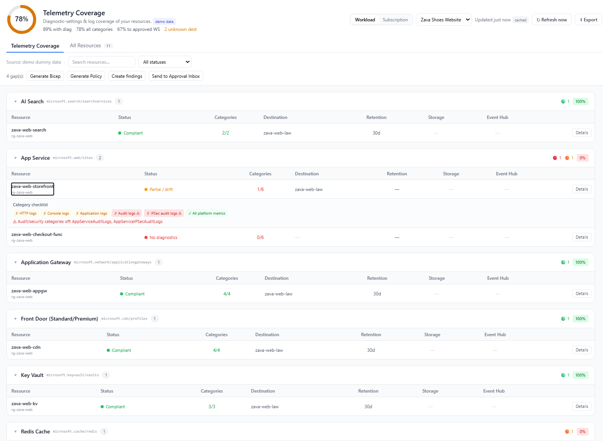<br/><sub><b>Telemetry coverage</b> — diagnostic-settings &amp; log coverage with Bicep/Policy gap fixes.</sub></td>
<td width="50%">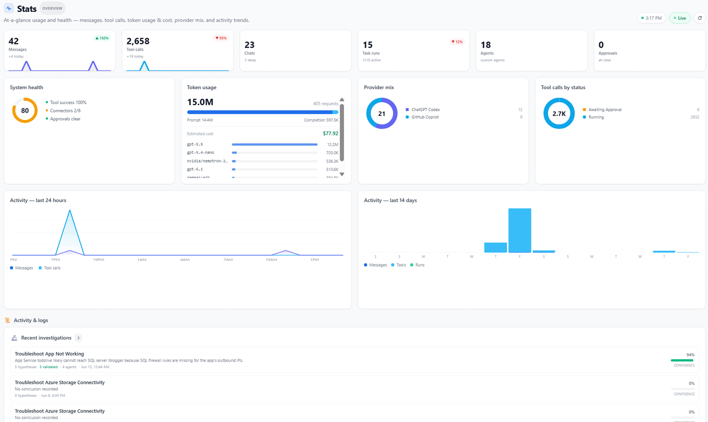<br/><sub><b>Monitor 2.0</b> — usage, token cost, provider mix, and activity at a glance.</sub></td>
</tr>
<tr>
<td width="50%">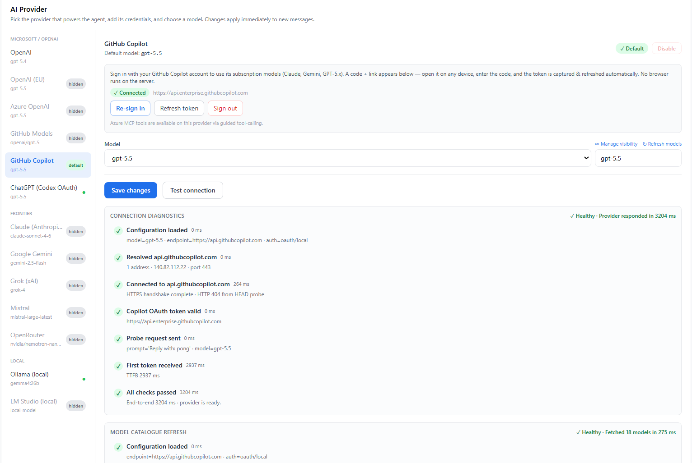<br/><sub><b>AI providers</b> — bring your own model; each one stays disabled until configured.</sub></td>
<td width="50%">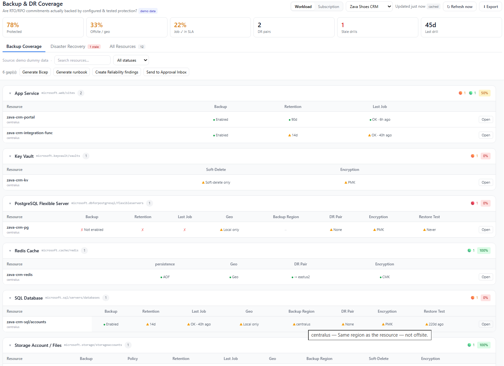<br/><sub><b>Backup &amp; DR coverage</b> — RTO/RPO protection posture with Bicep/runbook gap fixes.</sub></td>
</tr>
<tr>
<td width="50%">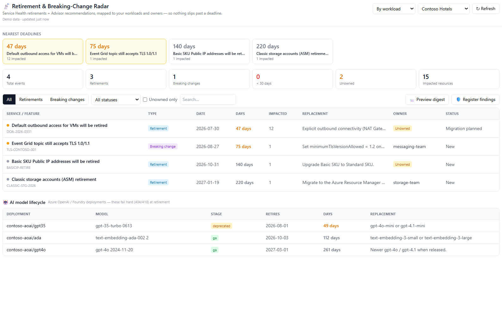<br/><sub><b>Retirement radar</b> — service retirements &amp; breaking changes mapped to workloads, owners, and deadlines.</sub></td>
<td width="50%"></td>
</tr>
</table>

## 🚀 Deploy to Azure (one-click)

> **Status: tested.** Provisions a managed PostgreSQL database, Azure Files state storage,
> and the Container App running the public image — in **your** subscription, in one
> deployment. No CLI, no manual wiring.

[](https://portal.azure.com/#create/Microsoft.Template/uri/https%3A%2F%2Fraw.githubusercontent.com%2Fzmustafa%2FAzureSupportAgent%2Fmain%2Fdeploy%2Fmain.json)

What it creates:

1. **Azure Container App** running the public Docker Hub image
2. **Azure Database for PostgreSQL — Flexible Server** (managed), auto-linked via `DATABASE_URL` (`?ssl=require`)
3. **Azure Files** share mounted at `/app/.data` (registries, caches, encryption key)
4. **Container Apps environment** + external HTTPS ingress on port 8000

> 💰 **Estimated cost: ~$25–35 / month** for the default infra at typical low/idle usage
> (West US 3, pay-as-you-go) — mostly the Container App (1 vCPU / 2 GiB) and a Burstable
> `B1ms` PostgreSQL server.

You supply only an **admin password** (you're forced to change it on first login). Then
connect your Azure tenant and an LLM from **Settings** — the AI does the rest (workload
discovery, architectures, coverage scans, assessments, retirement radar, performance
profiling). Defaults to **West US 3** (validated for Container Apps + PostgreSQL B1ms).

📖 New here? Follow the **[step-by-step installation guide](docs/INSTALLATION.md)** — from
clicking the button to onboarding your first workload.

Prefer the CLI or want full control? See the **[manual deployment guide](docs/DEPLOYMENT.md)**.

## ⚡ Quick start (local)

**Prerequisites:** Docker Desktop · Azure CLI (`az`) · an LLM key (or a local Ollama / LM Studio).

```pwsh
# 1) Sign in to the subscription you want to work with
az login
az account set --subscription "<your-subscription-id>"

# 2) Configure environment
Copy-Item .env.example .env     # set LLM_API_KEY (optional — you can also do it in the UI)

# 3) Run the whole stack
docker compose up --build
```

Open **http://localhost:5173**. The backend runs DB migrations on startup; the first Azure
MCP call fetches `@azure/mcp` via `npx` (a few seconds), then caches it.

**Health check:** [`/healthz`](http://localhost:8000/healthz) · MCP tools (admin):
`/api/admin/mcp/tools`

Full local/dev instructions (native backend, tests, type-check) live in
**[CONTRIBUTING.md](CONTRIBUTING.md)**.

## 🧩 How it works

The whole app — FastAPI **API + the built React SPA + the in-process MCP servers** — ships
as **one container image** and runs as a **single Container App**. No separate frontend,
database, or Redis containers required.

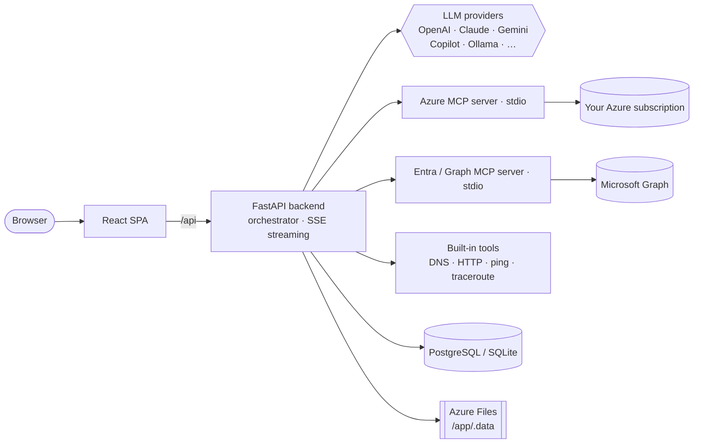
```mermaid
flowchart LR
    U([Browser]) --> SPA[React SPA]
    SPA -->|/api| BE[FastAPI backend<br/>orchestrator · SSE streaming]
    BE --> LLM{{LLM providers<br/>OpenAI · Claude · Gemini<br/>Copilot · Ollama · …}}
    BE --> AZ[Azure MCP server · stdio]
    BE --> EID[Entra / Graph MCP server · stdio]
    BE --> TOOLS[Built-in tools<br/>DNS · HTTP · ping · traceroute]
    BE --> DB[(PostgreSQL / SQLite)]
    BE --> FILES[[Azure Files<br/>/app/.data]]
    AZ --> SUB[(Your Azure subscription)]
    EID --> GRAPH[(Microsoft Graph)]
```

For local dev nothing is deployed to Azure — the MCP server reaches your real subscription
**outbound** using your signed-in identity and existing RBAC, **read-only by default**.

## 🔧 Tech stack

| Layer | Tech |
| --- | --- |
| **Backend** | Python 3.12 · FastAPI · async SQLAlchemy 2 · Pydantic v2 · Alembic · SSE |
| **Frontend** | React 18 · TypeScript · Vite · Tailwind · TanStack Query · Recharts · XYFlow · Mermaid |
| **AI** | Provider abstraction with streaming + normalized tool-calls (11+ providers) |
| **Azure** | Official Azure MCP server (`@azure/mcp`) · Azure CLI / Resource Graph runner |
| **Entra ID** | Vendored Microsoft Graph (EntraID) MCP server over stdio |
| **Data** | PostgreSQL (prod) / SQLite (local) · Azure Files for state |
| **Hosting** | Azure Container Apps (single image) |

## 🔐 Security & access model

- **Read-only by default.** The Azure MCP server starts with `--read-only`; write-capable tools are classified, **approval-gated**, and **audited**.
- **AI providers off until configured.** A fresh install ships every provider disabled; a provider only becomes selectable once you add a key (or sign in / set a local base URL).
- **Identity & SSO.** Local users with RBAC (users / roles / groups), plus OIDC and SAML SSO. Forced password change on first admin login.
- **Secrets.** Connection credentials are encrypted at rest and never returned to the UI. `.env`, `backend/.data/`, and keys are git-ignored.
- **Found a vulnerability?** Please follow **[SECURITY.md](SECURITY.md)** — don't open a public issue.

## 📚 Documentation

| Doc | What's inside |
| --- | --- |
| [docs/INSTALLATION.md](docs/INSTALLATION.md) | Step-by-step one-click install: deploy, first login, connect an LLM & tenant, onboard a workload |
| [docs/TECHNICAL_SPEC.md](docs/TECHNICAL_SPEC.md) | Full architecture & feature specification |
| [docs/DEPLOYMENT.md](docs/DEPLOYMENT.md) | Manual Azure Container Apps deploy, env vars, cost/scaling, gotchas |
| [docs/ENTRA_SETUP.md](docs/ENTRA_SETUP.md) | EntraID (Microsoft Graph) MCP setup + required permissions |
| [CONTRIBUTING.md](CONTRIBUTING.md) | Local dev, tests, type-check, PR guidelines |
| [SECURITY.md](SECURITY.md) | Vulnerability disclosure policy |
| [CODE_OF_CONDUCT.md](CODE_OF_CONDUCT.md) | Community guidelines |

## 🤝 Contributing

Contributions are welcome! Please read **[CONTRIBUTING.md](CONTRIBUTING.md)** and our
**[Code of Conduct](CODE_OF_CONDUCT.md)**. Good first steps: open an issue to discuss a
change, keep PRs focused, and make sure backend tests and the frontend type-check pass.

## 📄 License

[MIT](LICENSE) © 2026 Zeeshan Mustafa ([@zmustafa](https://github.com/zmustafa))

## 🙏 Acknowledgements

- [Azure MCP server](https://github.com/Azure/azure-mcp) — the official Azure tool surface
- EntraID MCP server (Microsoft Graph, FastMCP) — vendored under `third_party/`
- The Model Context Protocol community

<div align="center"><sub>If this project helps you, consider giving it a ⭐ — it helps others find it.</sub></div>

